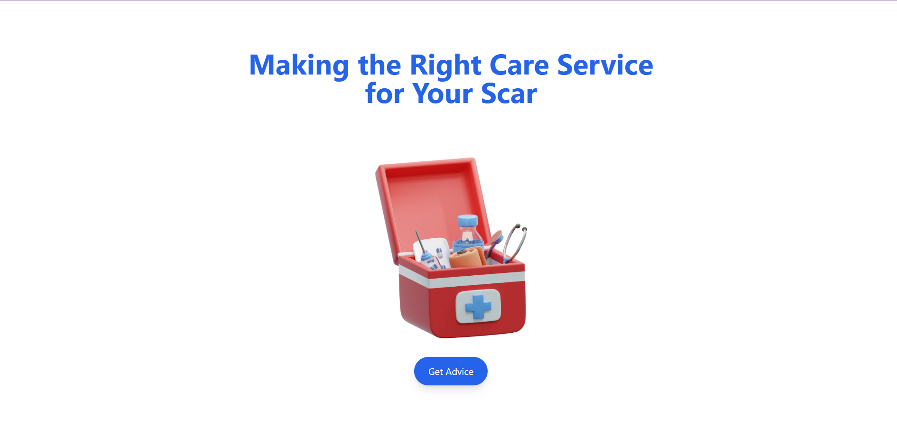
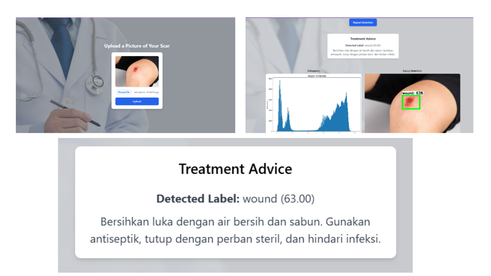

# 🚑 Injury — Smart First-Aid Assistant for Wound Detection

**Injury** is an intelligent health assistant designed to instantly provide treatment guidance for external wounds. With just one photo, users receive real-time first-aid suggestions that are practical, fast, and easy to access. Whether you're at home or on the move, Injury offers a simple solution to manage minor injuries quickly and responsibly.

> ⚡ Take a photo. Injury provides you with the best treatment suggestions.



---

## 🔍 Key Features

- 🧠 **AI-Powered Wound Detection**: Automatically detects various wound categories from a single image using a custom-trained object detection model.
- 💡 **Instant First-Aid Guidance**: Provides real-time, practical first-aid suggestions based on the detected wound type.
- 💻 **Fully Automated**: Ideal for individuals on the move or in emergencies with no need for manual input.
- 📱 **Responsive UI/UX**: Built with React.js to deliver a clean, user-friendly web interface.

---

## 🧠 The AI Model

The object detection model behind Injury was trained using a combination of **wound image datasets** and **custom-annotated data** for improved accuracy on various wound types.

- Trained with **YOLOv8** via **Ultralytics** on [Google Colab](https://colab.research.google.com/drive/17E-j43WFBmbD06q201Vg7uR2CC1tDF9w?usp=sharing)
- Fine-tuned on personal and real-world injury data for better generalization
- For details and the model file, visit this drive:  
  👉 [Model File Drive](https://drive.google.com/drive/folders/1CcyVkU5CCIiUczs6y6Hdyl3u0g1FP6Wt?usp=sharing)

---

## 🛰️ Model Deployment

The model is served using:

- 🧠 **Google Colab** as the compute environment
- 🌐 **Ngrok** to expose the local server to a public URL
- 🚀 **Flask** as the lightweight backend API

To run the model server:

1. Open the [Colab Deployment Notebook](https://colab.research.google.com/drive/17E-j43WFBmbD06q201Vg7uR2CC1tDF9w?usp=sharing)
2. Connect your Google Drive and mount the model assets [Model File Drive](https://drive.google.com/drive/folders/1CcyVkU5CCIiUczs6y6Hdyl3u0g1FP6Wt?usp=sharing)
3. Paste your **Ngrok API key** to the cell
4. Copy the **Ngrok public URL** once the server is running

---

## 🚀 Getting Started (Frontend)

To use the Injury Web App:

1. **Clone this repository**:

   ```bash
   git clone https://github.com/yourusername/injury.git
   cd injury

   ```

2. **Update the API URL**:  
   Replace all API endpoint URLs inside the React project with the **Ngrok public URL** obtained from the Colab deployment.

   Specifically, update the API URL in the following files:

   - `src/section/ImageUploader.jsx`
   - `src/services/api.js`

3. **Install dependencies**:

   ```bash
   npm install

   ```

4. **Start the UI Website**:

   ```bash
   npm run dev

   ```

Now, you're ready to test the app. Upload an image of an injury, and watch Injury provide treatment suggestions instantly! 🚑

## Example Output



## 🧰 Tech Stack

- **Frontend**: React.js, Vite, TypeScript
- **Backend**: Flask (served via Colab + Ngrok)
- **Model**: YOLOv8 (Ultralytics)
- **Deployment**: Google Colab for backend API
- **Data**: Custom + Public Wound Datasets on Roboflow

---

## 🖼️ Sample Use Case

Check out before-after visual examples (coming soon) where Injury identifies wounds and outputs first-aid treatment suggestions — perfect for healthcare professionals, first responders, and anyone in need of instant injury care.

---

📺 **For a full demonstration, watch the documentation video here**:  
[👉 Injury Demo on YouTube](https://youtu.be/1vbSfwaUbw0)

---

## 🤝 Contributions

Contributions, feature suggestions, or feedback are welcome!  
Feel free to open issues or submit pull requests.

---

## 📄 License

This project is licensed under the **MIT License** — use freely with attribution.

---

> “Track smart, heal smart. Injury helps you respond to wounds better.”
